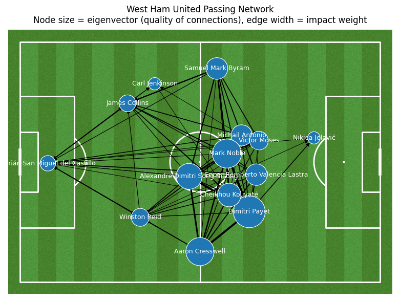
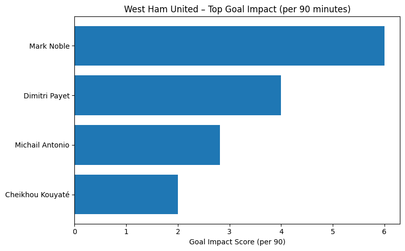
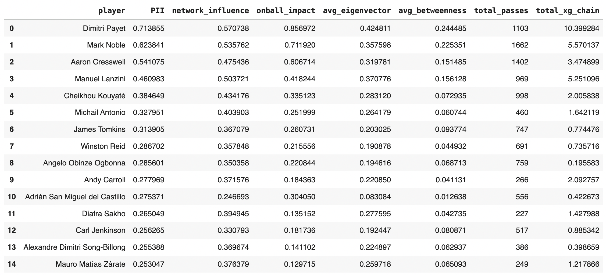
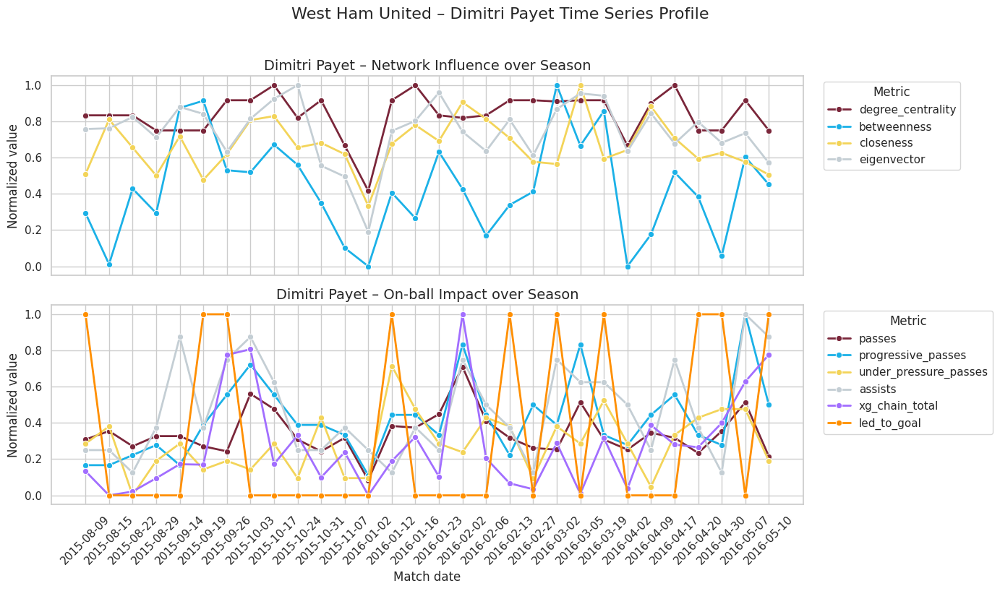
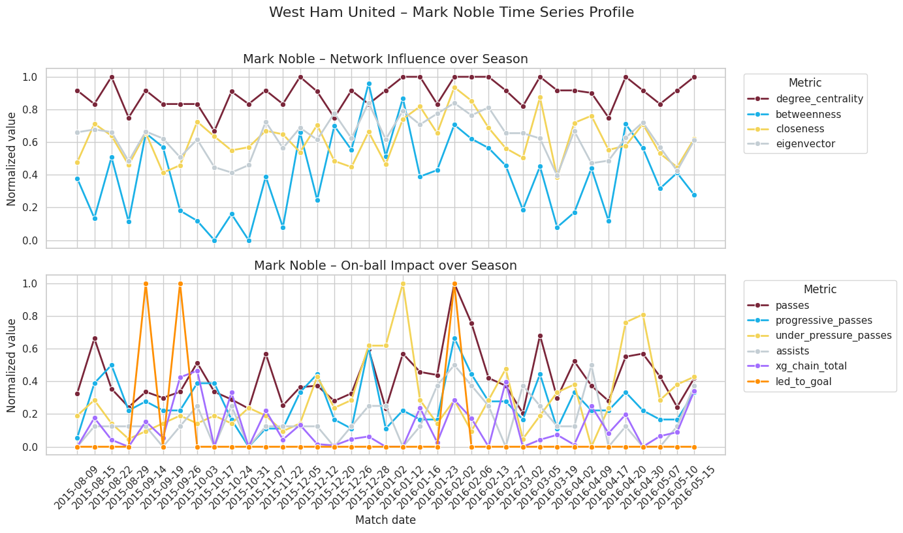
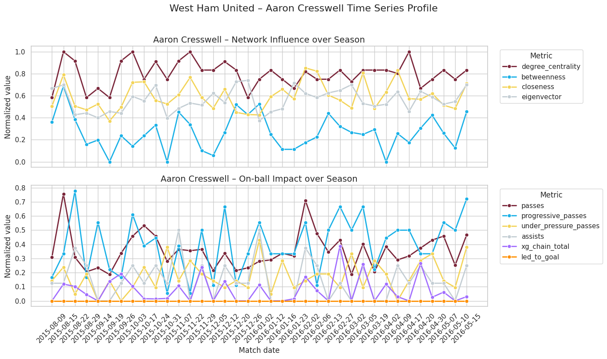
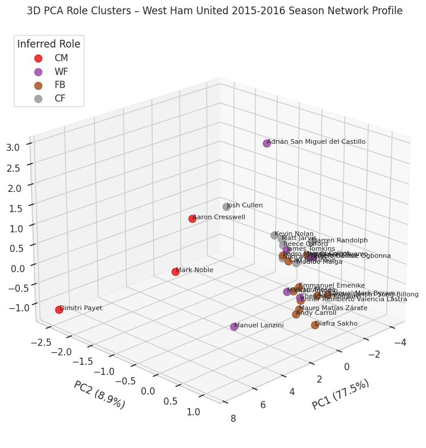
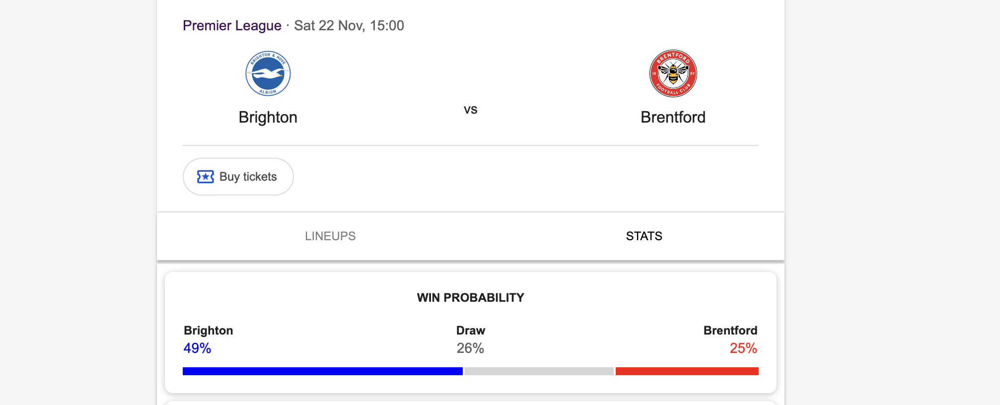

# West Ham United — Passing Network Analytics (Premier League 2015–16) + Double Poisson Model for Predicting Football Results

Advanced graph-based football analytics applied to West Ham United’s 2015–16 Premier League matches.

This repository contains three Jupyter notebooks:

1) **Single-Match Analysis**
2) **Full-Season Analysis**

Both notebooks use **StatsBomb Open Data**, network science, xG-chain logic, and PCA clustering to extract tactical and performance insights from match events.

3) **Double Poisson Model for Predicting Football Results**

This notebook investigates two variants of the double Poisson framework for football score prediction and applies them to forecast the outcome of an upcoming Premier League match between Brighton and Brentford that will be held on Saturday, 22 November 2025. The analysis and results were produced and uploaded on Tuesday, 18 November 2025.

---

# 1. Match Notebook  
## **West Ham United Passing Network — Match Analysis**  
### Premier League 2015–16 — 23 January 2016  
### West Ham United 2 – 2 Manchester City  
**Notebook file:** `whu_match_2016-01-23.ipynb`

### **Overview**
This notebook performs a deep tactical breakdown of one match using network theory. Key steps include:

- Loading and parsing StatsBomb event JSON  
- Filtering completed WHU passes  
- Tagging progressive passes (distance-to-goal reduction)  
- Identifying goal-chain sequences  
- Aggregating edges between players  
- Building a **spatially anchored directed passing network**  
- Computing centrality metrics:
  - Degree centrality  
  - Betweenness centrality  
  - Closeness centrality  
  - Eigenvector centrality  
- Computing **Goal-Chain Impact Score per 90** (build-up involvement + assists)

---

## **Match Visualizations**

### **Spatial Passing Network Visualization**

This graphic shows:

- Players positioned at their average on-ball locations  
- Node size scaled by **eigenvector centrality** (quality of connections)  
- Edge width scaled by a **composite passing impact weight**:
  - total passes  
  - progressive passes  
  - assists  
  - goal-chain actions  
- Arrows showing direction & frequency of connections  

This combines tactical structure + network influence in one view.

---

### **Goal-Chain Impact Scoring**

This visualization shows which WHU players contributed most to:

- build-up passes in goal-scoring possessions  
- passes received in those same possessions  
- assists  
- per-90 adjusted impact score  

It highlights which players were central to the scoring process — beyond just goals and assists.

---

---

# 2. Full Season Notebook  
## **West Ham United Passing Network — Full-Season Analysis (2015–16)**  
### Advanced Influence Metrics, Progression Analysis & PCA Role Clustering  
**Notebook file:** `whu_full_season_passing_networks.ipynb`

### **Helicopter View — What This Notebook Does**
This full-season pipeline processes **38 Premier League matches** and aggregates passing networks across the season to study:

- Individual player influence  
- Structural importance in possession  
- Progression profiles  
- Goal-chain behavior  
- xG-chain contribution  
- Role-based clustering

Key techniques used:

- Directed weighted network graphs per match  
- Progressive pass detection  
- Goal-chain + xG-chain derived metrics  
- Eigenvector / betweenness / closeness / centrality  
- Time series analysis  
- PCA dimensionality reduction  
- KMeans role clustering (FB, CM, WF, CF)

---

## **Season-Level Outputs**

### **Season Summary Table for top 15 WHU players**

---

### **Top 3 Players — Time Series Progression**

For **Dimitri Payet**, **Mark Noble**, and **Aaron Cresswell**, we plot two timelines:

1) **Network Influence**  
   - degree centrality  
   - betweenness  
   - closeness  
   - eigenvector  

2) **On-Ball Impact**  
   - progressive passes  
   - pressurized passes  
   - assists  
   - xG-chain  

#### **Dimitri Payet Time Series Progression**

#### **Mark Noble Time Series Progression**

#### **Aaron Cresswell Time Series Progression**

---

### **Dimensionality Reduction & Role-Based Clustering**

Using PCA(3) + KMeans(4), players are clustered into 4 intuitive tactical roles:

- **FB** — Fullbacks (wide, medium progression)  
- **CM** — Central midfielders (high involvement, high pass volume)  
- **WF** — Wingers / creators (progressive actions, xG-chain)  
- **CF** — Forwards (goal-chain, low network centrality but high xG involvement)

This provides a data-driven lens on squad roles.

---

# 3. Double Poisson Model for Predicting Football Results
## Comparing Match Outcome Predictions Across Two Modelling Strategies
**Notebook file:** `poisson_brighton_vs_brentford_sat_22_nov_2025.ipynb` 

This notebook implements and compares two statistical approaches for football score prediction using the double Poisson framework: the Loukas et al. model and the Penn–Donnelly OA/VB formulation. Both models are fitted to historical Premier League match data and then applied to forecast the outcome of the upcoming Brighton vs Brentford match scheduled for 22 November 2025.

The Loukas model uses season-level averages of goals scored and conceded to derive team attacking and defensive ratings, combined with an explicit home-advantage term. It predicts a slightly favourable outcome for Brighton, estimating a **49.1%** win probability, **20.2%** chance of a draw, and **30.7%** probability of a Brentford victory. The most likely exact scoreline under this model is **Brighton 2–1 Brentford (8.1%)**.

The Penn–Donnelly OA/VB model instead estimates team strengths using maximum-likelihood optimisation over the full distribution of match results, without imposing a separate home-advantage term. This approach produces a more balanced view of the match, with **40.1%** probability of a Brighton win, **23.5%** probability of a draw, and **36.4%** chance of a Brentford win. The most likely exact scoreline under this specification is **1–1 (10.5%)**.

Overall, the notebook demonstrates how different statistical formulations of the double Poisson model can yield distinct but informative match predictions, and serves as a practical example of implementing football analytics methods for real-world forecasting tasks.

---

# Citation

Raw match data comes from:  
**StatsBomb Open Data**  
https://github.com/statsbomb/open-data  
